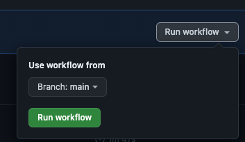

# Custom Deployment Protection Rules Demo
GitHub.com has a great new feature called "[custom deployment protection rules](https://docs.github.com/en/actions/deployment/protecting-deployments/creating-custom-deployment-protection-rules)" (currently in beta) which allows you to receive webhooks whenever a deployment is triggered. This works in tandem with [Environments](https://docs.github.com/en/actions/deployment/targeting-different-environments/using-environments-for-deployment) to provides gated mechanisms for preventing deployments when not authorized.

 

The demo here is an attempt to display how the feature works (currently) so that when it goes GA you will have the ability to utilize it yourself.

**NOTE** this demo only works on GitHub organizations supporting Environments.

## Respository Contents
- [Workflow file](./.github/workflows/deployment.yml)
- TypeScript Example files for responding to webhook events
- Demo `.env_example` file (to keep sensitive values out of command history)
- Instructions in this file for how to set everything up.

## Prerequisites
- A [Bash](https://opensource.com/resources/what-bash)-compatible or [PowerShell](https://learn.microsoft.com/en-us/powershell/scripting/install/installing-powershell?view=powershell-7.3) (>= v6) terminal
- [Node.JS](https://nodejs.org/en/download) (tested on v20.5.1) installed and available in your path (runs the webhook listening software)
- [Ngrok](https://dashboard.ngrok.com/get-started/setup) installed and configured (handles receiving the webhook to the webhook listening software)
- Organization owner access

## Steps
Follow all the steps below to see this demo in action.

### Copy This Repository To Your Own
In order to test out the functionality here, you will need to set up and configure this repo in your own organization (user-owned repositories NOT supported).

1. Create a new **unitialized**`*` [repository](https://docs.github.com/en/get-started/quickstart/create-a-repo) in the organization of your choice.

   1. `*`: An unitialized repository has no branches or commits and can be used to push an existing repostiry to.

1. [Clone](https://docs.github.com/en/repositories/creating-and-managing-repositories/cloning-a-repository) this repository.

1. Open a Bash-compatible or PowerShell (>= v6) terminal and `cd` into this cloned repository (ex: `cd <path-to-repo>`).

1. Change the repository remote to your created repository from step #1 using the following command (replace `<remote-url>` with your own):  `git remote set-url origin <remote-url>`

All pushes will now be sent to your repository for any changes you make.

---

### Set Up An Environment
1. Following the [instructions here](https://docs.github.com/en/actions/deployment/targeting-different-environments/using-environments-for-deployment#creating-an-environment) for creating an environment in your repository. 

   Use the name `prod` (all lowercase).

---

### Run Ngrok
Ngrok takes internet requests and sends them to your local machine so that the Node.JS application can process them. You will need the provided URL when [creating your GitHub App](#create-a-github-app). See [prerequisites](#prerequisites) for this requirement.

1. Run the command `ngrok http 80` in a separate terminal.
1. Make note of the forwarding URL (ex: `https://<guid>.ngrok-free.app`).

The Ngrok software will stay running until you stop it.

---

### Create A GitHub App
1. Follow the [instructions here](https://docs.github.com/en/actions/deployment/protecting-deployments/creating-custom-deployment-protection-rules#creating-a-custom-deployment-protection-rule-with-github-apps) for creating a GitHub App that can communicate with GitHub on behalf of your software that will handle the deployment protection.

   **NOTE**: You will need to provide your [Ngrok URL](#run-ngrok) to the `Webhook URL` value when creating the App.

1. Be sure to save the following values for next steps:
   1. The webhook secret used in the App creation process.
   1. The private key file generated (`.pem`)
   1. The App ID (displayed on the App configuration page)
   1. The App Installation ID (in the URL bar when configuring the App on your organization)

---

### Configure Environment Variables
1. Create a file called `.env` in the root of this repository.
1. Copy the contents of [.env_example](./.env_example) to the `.env` file.
1. Modify all values replacing with correpsonding ones.

|variable name|description|
|---|---|
|WEBHOOK_SECRET|The value you used for your webhook configuration in the GitHub App|
|GH_APP_ID|The ID of the GitHub App you created|
|GH_APP_INSTALL_ID|The installation ID of the GitHub app on your organization|
|GH_PRIVATE_KEY|The contents of the private key file generated for the app (expects line returns)

---

### Run The Webhook Listener
1. From a new terminal (**NOT** the terminal running Ngrok), `cd` into this repository and run: `npm run listen`

The listener software will listen on port 80 and stay running until you stop it.

---

### Configure The Repository To Use Your Custom Deployment Protection Rules
1. Follow the [instructions here](https://docs.github.com/en/actions/deployment/protecting-deployments/configuring-custom-deployment-protection-rules#enabling-custom-deployment-protection-rules-for-the-environment) to enable the custom deployment protection rules app on your repository.

---

### Attempt to Trigger A "Deployment"
1. Navigate to the `Actions` tab on this repository

1. Click the `Deployment` workflow

1. Click the `Run Workflow` button, leave `Main` branch selected, and click the green `Run Workflow` button.

---

### Results
This should result in the workflow pausing to wait for approval. You should also see your Ngrok terminal take a POST payload and your Node terminal begin outputting various details about what it's currently doing.

The way that the application is configured is to sleep for 30 seconds and then approve the deployment. You could add logic or communication to third-party services by simply adding it to [line 80 of index.ts](./index.ts#80). 

---

## Links To Documentation
- [Creating Deployment Protection Rules](https://docs.github.com/en/actions/deployment/protecting-deployments/creating-custom-deployment-protection-rules)
- [Approving Or Rejecting Deployments](https://docs.github.com/en/actions/deployment/protecting-deployments/creating-custom-deployment-protection-rules#approving-or-rejecting-deployments)
- [Using Deployment Protection Rules](https://docs.github.com/en/actions/deployment/protecting-deployments/configuring-custom-deployment-protection-rules)
- [Securing Webhooks](https://docs.github.com/en/webhooks/using-webhooks/securing-your-webhooks#typescript-example)
- [Endpoint Documentation](https://docs.github.com/en/rest/actions/workflow-runs?apiVersion=2022-11-28#review-custom-deployment-protection-rules-for-a-workflow-run)